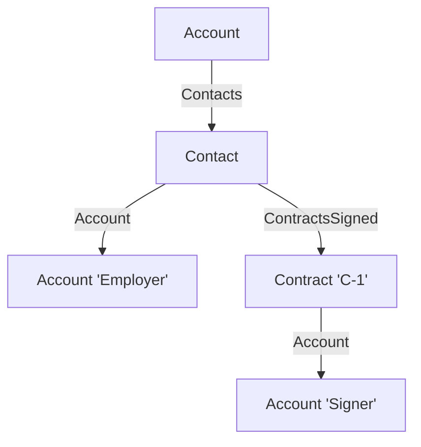

# Fabricator

Build in-memory test data of any shape: SObjects with read-only fields and nested relationships, platform types without a public constructor, custom DTOs. No DML, no SOQL.

```apex
Object Fabricator.make(Type targetType, Map<String, Object> values)
Id     Fabricator.nextId(Schema.SObjectType sot)
```

## Why

Apex refuses to build what the platform builds all the time:

| You need                                     | Plain Apex                         | Fabricator |
| -------------------------------------------- | ---------------------------------- | ---------- |
| `Opportunity.IsClosed`, formula, audit field | `Field is not writeable`           | ✅         |
| `account.Contacts = contacts`                | `Field is not writeable`           | ✅         |
| `Database.SaveResult` in a failed state      | no public constructor              | ✅         |
| An Id for an unsaved record                  | DML insert                         | ✅         |
| Relationships deeper than 5 levels           | SOQL caps parent-child at 5 levels | ✅         |

Pair it with `DAL.mock()`: the unit under test gets exactly the records and results it would receive from the database, without ever touching it.

## Usage

### Simple: a record with read-only fields

```apex
Opportunity renewal = (Opportunity) Fabricator.make(
  Opportunity.class,
  new Map<String, Object>{
    'Id' => Fabricator.nextId(Opportunity.SObjectType),
    'Name' => 'Renewal',
    'IsClosed' => true // read-only
  }
);
```

### Complex: parents and children

```apex
Account account = (Account) Fabricator.make(
  Account.class,
  new Map<String, Object>{
    'Name' => 'Acme',
    'Parent' => new Account(Name = 'Acme Holding'),
    'Contacts' => new List<Contact>{ new Contact(LastName = 'Doe') },
    'Opportunities' => new List<Opportunity>{ new Opportunity(Name = 'Renewal') }
  }
);

account.Parent.Name; // 'Acme Holding'
account.Contacts[0].LastName; // 'Doe'
```

Parents are plain SObjects. Children are any `List<SObject>`.

### Advanced: children of children, with their own parents

Fabricate bottom-up; each fabricated record becomes a value of the next level.

```apex
Contract contract = (Contract) Fabricator.make(
  Contract.class,
  new Map<String, Object>{ 'ContractNumber' => 'C-1', 'Account' => new Account(Name = 'Signer') }
);
Contact contact = (Contact) Fabricator.make(
  Contact.class,
  new Map<String, Object>{
    'Name' => 'Jane Doe', // compound, read-only
    'Account' => new Account(Name = 'Employer'),
    'ContractsSigned' => new List<Contract>{ contract }
  }
);
Account account = (Account) Fabricator.make(
  Account.class,
  new Map<String, Object>{ 'Contacts' => new List<Contact>{ contact } }
);

account.Contacts[0].ContractsSigned[0].Account.Name; // 'Signer'
```



Depth is not capped by SOQL: the spec builds a 10-level `ChildAccounts` chain.

### Platform types

```apex
Database.SaveResult failure = (Database.SaveResult) Fabricator.make(
  Database.SaveResult.class,
  new Map<String, Object>{
    'success' => false,
    'errors' => new List<Object>{
      new Map<String, Object>{ 'message' => 'duplicate', 'statusCode' => StatusCode.DUPLICATE_VALUE }
    }
  }
);
```

Same for `Database.UpsertResult` (`created`), `Database.DeleteResult` and `Database.UndeleteResult`.

### Custom DTOs

Any type `JSON.deserialize` accepts:

```apex
public class Invoice {
  public String reference;
  public Decimal total;
}

Invoice invoice = (Invoice) Fabricator.make(Invoice.class, new Map<String, Object>{ 'reference' => 'INV-1', 'total' => 42 });
```

## Ids

`nextId` returns the next Id of a per-transaction sequence: key prefix + 12-digit counter.

```apex
Fabricator.nextId(Account.SObjectType); // 001000000000001
Fabricator.nextId(Contact.SObjectType); // 003000000000002
```

- Valid `Id`: `Id.getSObjectType()` works.
- Unique within the transaction, across all types.
- Never persisted: querying it returns nothing.
- Throws `IllegalArgumentException` for types without key prefix (`AggregateResult`).

## Philosophy

Don't fight the platform, borrow its constructor. `JSON.deserialize` builds SObjects from the same shape the APIs return for a query, and it does not check field writability. Fabricator writes that payload and lets the platform build the instance.

```
values ──JSONGenerator──▶ JSON (QueryResult shape) ──JSON.deserialize──▶ typed instance
```

- **One generic entry point.** No builder per type, no schema knowledge: whatever the deserializer accepts, `make` builds.
- **Children in wire format.** A `List<SObject>` value is written as `{ totalSize, done, records }`, the only shape accepted for a child relationship.
- **Order-compatible.** Fields are emitted in reverse insertion order, like `JSON.serialize(Map)`. Order-sensitive deserializers (`Database.SaveResult` lets a later `errors` reset `success`) behave as with the natural map order.

## Performance

- One `JSONGenerator` pass, one `JSON.deserialize`. No serialize/deserialize round trip per child (3 children went from 315-385 µs to 70-80 µs).
- Key prefixes are described once per type (`SObjectDescribeOptions.DEFERRED`) and cached.

CPU per call (Developer Edition, API 61, 200 iterations × 3 runs):

| Scenario              | µs    |
| --------------------- | ----- |
| 4 writable fields     | 55-65 |
| 1 read-only field     | 25-35 |
| parent + grandparent  | 50-55 |
| 3 child records       | 70-80 |
| `Database.SaveResult` | 60-70 |
| `nextId`              | ~5    |

## Gotchas

- Unknown fields are **silently ignored**: a typo leaves the field null.
- Wrong value types throw `JSONException` (`'AnnualRevenue' => 'abc'`).
- `@IsTest` class: usable from test context only.
